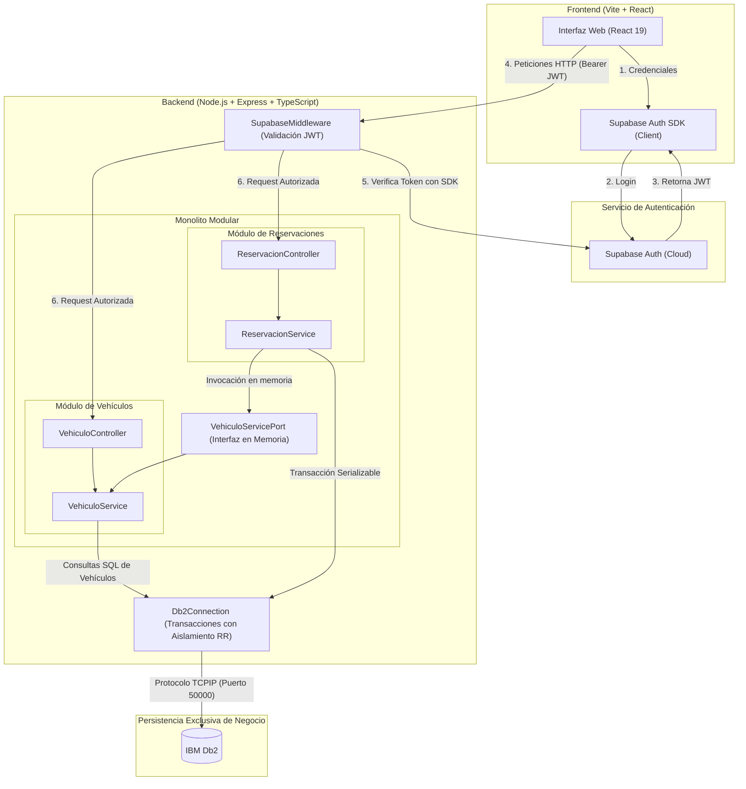
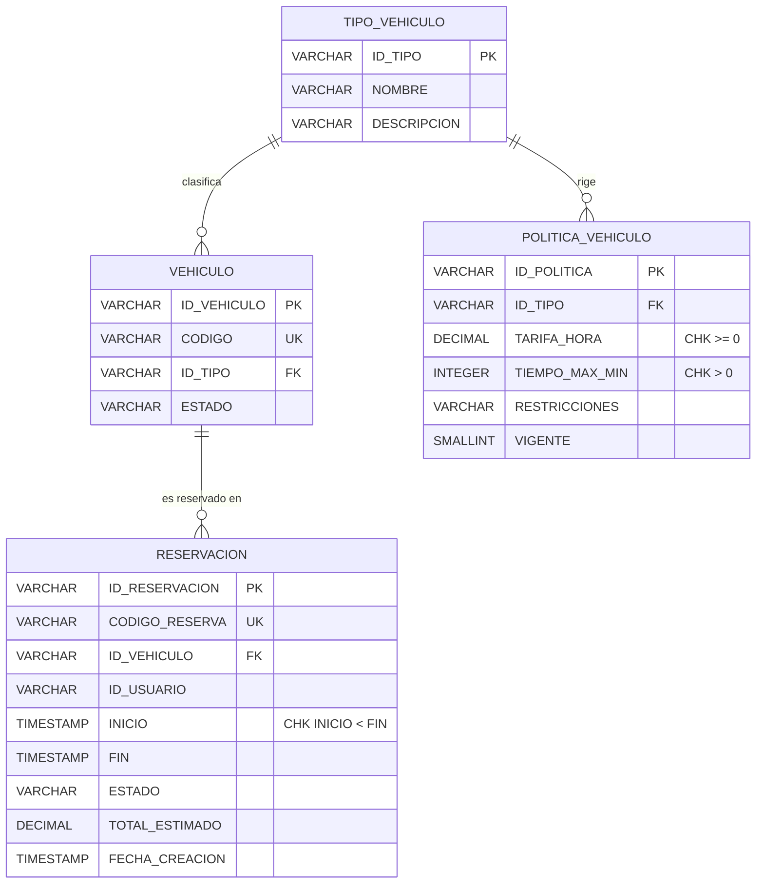
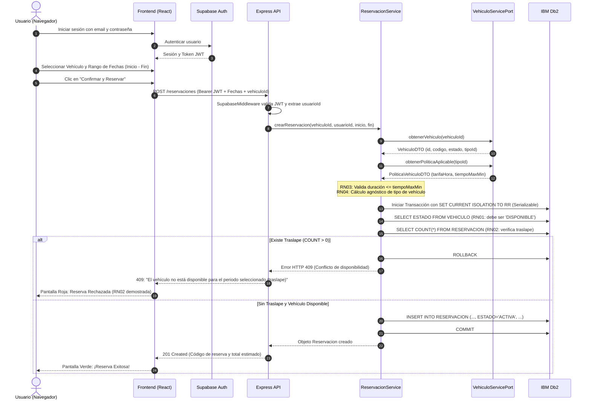

# UV Move - Actividad 10: Prueba de Concepto de Dos Módulos

Prueba de concepto (PoC) para el sistema **UV Move**, correspondiente a la **Actividad 10**. Demuestra la colaboración funcional y arquitectónica entre dos módulos clave:
1. **Módulo de Gestión de Vehículos**
2. **Módulo de Gestión de Reservaciones**

El proyecto respeta el diseño arquitectónico de la Actividad 9, aplicando un **Monolito Modular** desacoplado mediante puertos e interfaces tipadas, persistencia exclusiva de negocio en **IBM Db2**, y autenticación externa con **Supabase Auth**.

---

## 1. Stack Tecnológico

| Capa | Tecnología | Propósito |
|---|---|---|
| **Frontend** | React 19, Vite, TailwindCSS v4, React Router DOM v7 | Interfaz web responsiva para catálogo, reserva y confirmación. |
| **Backend** | Node.js, Express, TypeScript | API REST organizada como Monolito Modular. |
| **Autenticación** | Supabase Auth (JWT) | Identificación y seguridad de usuarios sin tocar BD de negocio. |
| **Persistencia de Negocio** | IBM Db2 | Única base de datos de negocio con soporte transaccional ACID. |
| **Driver BD** | `ibm_db` (ODBC/CLI Driver) | Conector nativo de alto rendimiento para Db2 en Node.js. |

---

## 2. Diagrama de Arquitectura

El backend opera como un **Monolito Modular**: ambos módulos residen en el mismo proceso de Node.js y se comunican **en memoria** a través de la interfaz de puerto `VehiculoServicePort`, sin realizar llamadas HTTP internas ni acoplarse directamente a las tablas de la otra entidad.



---

## 3. Modelo de Datos Relacional (IBM Db2)

El esquema de base de datos se encuentra completamente formalizado con claves primarias, foráneas, restricciones de unicidad y restricciones de chequeo de dominio (`CHECK`).



### Scripts de Base de Datos (`db/scripts/`)
Los scripts SQL deben ejecutarse en orden numerado:
1. `001_create_tables.sql`: Creación de tablas (`TIPO_VEHICULO`, `POLITICA_VEHICULO`, `VEHICULO`, `RESERVACION`).
2. `002_constraints.sql`: Claves primarias (`PK`), foráneas (`FK`) y unicidad (`UQ`).
3. `003_seed_data.sql`: Datos semilla base (Bicicletas, Scooter, políticas de uso y vehículos iniciales).
4. `004_add_check_constraints.sql`: **Evolución del modelo** agregando restricciones de dominio (`TARIFA_HORA >= 0`, `TIEMPO_MAX_MIN > 0`, `INICIO < FIN`).
5. `005_seed_reservation_test.sql`: **Evolución del modelo** que inserta una reservación de prueba en estado `ACTIVA` para el vehículo `V_BICI_001` (`BIC-001`) en un horario futuro (`2026-10-01 10:00:00` a `2026-10-01 12:00:00`), diseñada específicamente para demostrar el **rechazo por traslape (RN02)**.

---

## 4. Flujo de Reservación y Validación de Reglas de Negocio

El siguiente diagrama de secuencia detalla la colaboración entre módulos, la frontera transaccional y la aplicación de las reglas de negocio **RN01**, **RN02**, **RN03** y **RN04**.



---

## 5. Matriz de Reglas de Negocio (RN)

| Regla | Descripción | Implementación Técnica | Evidencia en Código |
|---|---|---|---|
| **RN01** | Solo se pueden reservar vehículos en estado `DISPONIBLE`. | Verificación de estado dentro de la transacción de reservación. | [ReservacionService.ts](file:///c:/Users/Alessandro/.gemini/antigravity-ide/scratch/uv-move-act10-poc/backend/src/reservaciones/application/ReservacionService.ts#L62-L66) |
| **RN02** | No se permiten reservaciones traslapadas para el mismo vehículo. | Verificación `COUNT` de reservaciones `ACTIVA` dentro de una transacción con aislamiento Serializable/RR (`SET CURRENT ISOLATION TO RR`). Retorna `HTTP 409`. | [ReservacionService.ts](file:///c:/Users/Alessandro/.gemini/antigravity-ide/scratch/uv-move-act10-poc/backend/src/reservaciones/application/ReservacionService.ts#L68-L84) |
| **RN03** | Límites de tiempo máximo y cálculo de costo por hora según política. | Consulta dinámica a `POLITICA_VEHICULO` a través de `VehiculoServicePort`. Lanza error 400 si la duración excede `tiempoMaxMin`. | [ReservacionService.ts](file:///c:/Users/Alessandro/.gemini/antigravity-ide/scratch/uv-move-act10-poc/backend/src/reservaciones/application/ReservacionService.ts#L35-L48) |
| **RN04** | Lógica de reservaciones agnóstica al tipo de vehículo. | El módulo de reservaciones no contiene condicionales `if (tipo === 'bicicleta')`; toda la lógica opera sobre los atributos del DTO de política. | [ReservacionService.ts](file:///c:/Users/Alessandro/.gemini/antigravity-ide/scratch/uv-move-act10-poc/backend/src/reservaciones/application/ReservacionService.ts#L46-L47) |

---

## 6. Configuración y Puesta en Marcha

### Prerrequisitos
- **Node.js** v18 o superior.
- **Docker** (para ejecutar el contenedor de IBM Db2).
- Proyecto en **Supabase** con Authentication habilitado.

### 1. Variables de Entorno
Copia los archivos de ejemplo y configura tus credenciales reales:

#### Backend (`backend/.env`):
```env
PORT=3000
DB2_CONNECTION_STRING=DATABASE=UVMOVE;HOSTNAME=localhost;UID=db2inst1;PWD=tu_contrasena;PORT=50000;PROTOCOL=TCPIP
SUPABASE_URL=https://tu-proyecto.supabase.co
SUPABASE_ANON_KEY=tu_supabase_anon_key
SUPABASE_PUBLISHABLE_KEY=tu_supabase_publishable_key
```

#### Frontend (`frontend/.env`):
```env
VITE_API_URL=http://localhost:3000
VITE_SUPABASE_URL=https://tu-proyecto.supabase.co
VITE_SUPABASE_ANON_KEY=tu_supabase_anon_key
VITE_SUPABASE_PUBLISHABLE_KEY=tu_supabase_publishable_key
```

### 2. Comandos de Ejecución

Desde la raíz del proyecto, puedes iniciar ambos componentes de forma independiente:

```powershell
# Terminal 1: Iniciar Backend (Express en http://localhost:3000)
npm run backend

# Terminal 2: Iniciar Frontend (Vite en http://localhost:5173)
npm run dev
```

*(También disponible dentro de cada subcarpeta mediante `npm run dev`)*.

---

## 7. Guía de Pruebas de los Escenarios

### Caso 1: Escenario Exitoso (Reserva Válida)
1. Abre el navegador en **`http://localhost:5173`**.
2. Inicia sesión con un correo y contraseña registrados en tu proyecto de Supabase Auth.
3. En la lista de vehículos disponibles, selecciona el vehículo **`V_BICI_002`** (`BIC-002`) o **`V_SCOOTER_001`** (`SCO-001`).
4. Selecciona un rango de fechas válido en el futuro (ej: 1 hora de duración dentro del límite de la política).
5. Haz clic en **Siguiente** y revisa el resumen de costos.
6. Haz clic en **Confirmar y Reservar**.
7. **Resultado esperado:** Pantalla verde de **¡Reserva Exitosa!** con el código de confirmación generado y el total estimado persistido en Db2.

---

### Caso 2: Escenario Rechazado (RN02 - Rechazo por Traslape)
1. Asegúrate de haber ejecutado el script [005_seed_reservation_test.sql](file:///c:/Users/Alessandro/.gemini/antigravity-ide/scratch/uv-move-act10-poc/db/scripts/005_seed_reservation_test.sql), el cual registra una reservación previa para **`V_BICI_001`** en el horario:
   - **Inicio:** `2026-10-01 10:00:00`
   - **Fin:** `2026-10-01 12:00:00`
2. En el frontend, selecciona el vehículo **`V_BICI_001`** (`BIC-001`).
3. Configura un horario que se traslape con la reserva existente, por ejemplo:
   - **Inicio:** `2026-10-01 11:00:00`
   - **Fin:** `2026-10-01 13:00:00`
4. Haz clic en **Siguiente** y luego en **Confirmar y Reservar**.
5. **Resultado esperado:** La transacción en Db2 detecta la superposición (`COUNT > 0`), hace `ROLLBACK` y responde con `HTTP 409`. El frontend muestra la pantalla roja de **Reserva Rechazada** con el mensaje:
   > *"El vehículo no está disponible para el periodo seleccionado (traslape)."*

---

### Caso 3: Rechazo por Exceso de Tiempo Máximo (RN03)
1. Selecciona un vehículo cuyo tipo tenga restricción de tiempo (ej: Scooter con límite de 120 minutos).
2. Intenta ingresar un periodo de 3 horas (180 minutos).
3. **Resultado esperado:** El sistema valida la política antes de iniciar la transacción y rechaza la solicitud con `HTTP 400`:
   > *"La reservación excede el tiempo máximo permitido de 120 minutos."*

---

### Caso 4: Seguridad y Autenticación (401 Unauthorized)
1. Intenta realizar una petición manual `POST /reservaciones` o `GET /vehiculos` sin cabecera `Authorization: Bearer <token>`.
2. **Resultado esperado:** `SupabaseMiddleware` intercepta la petición y responde con `HTTP 401 Unauthorized` sin consultar la base de datos de negocio.
